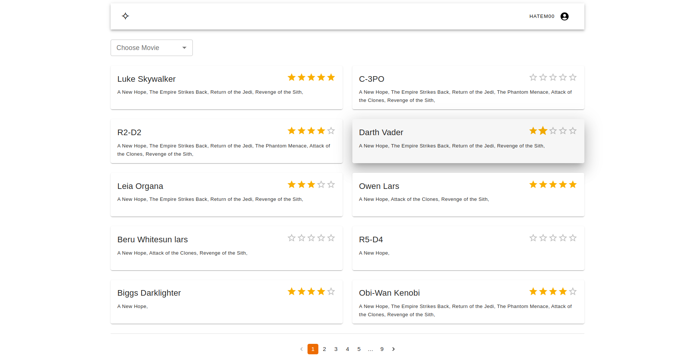
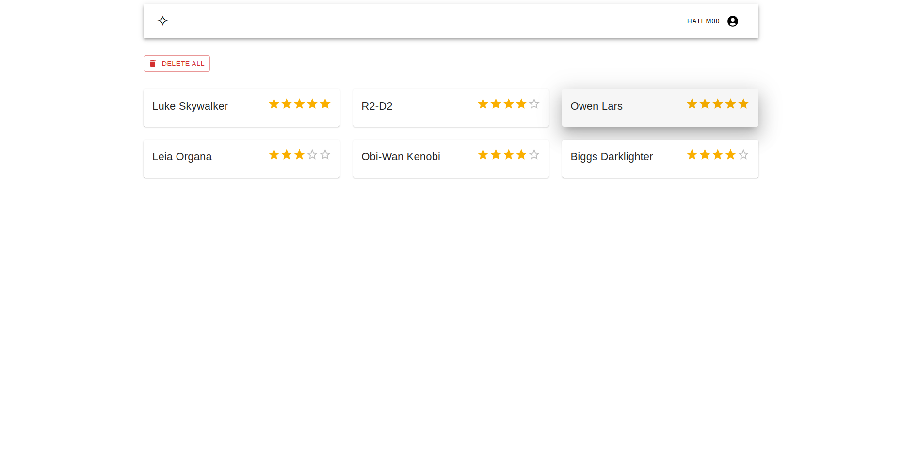
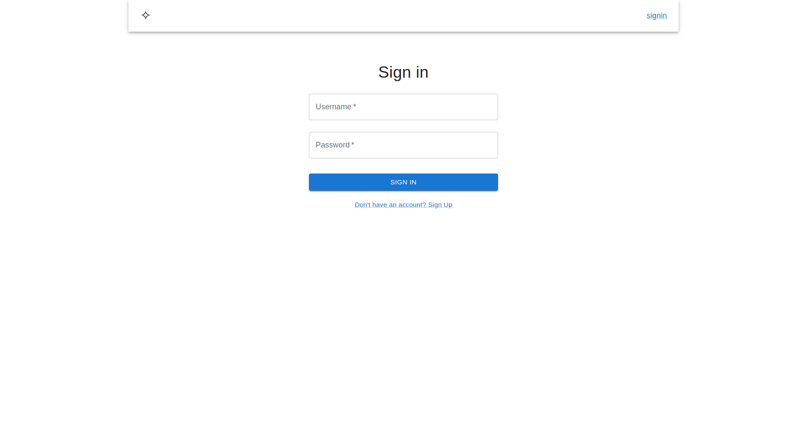
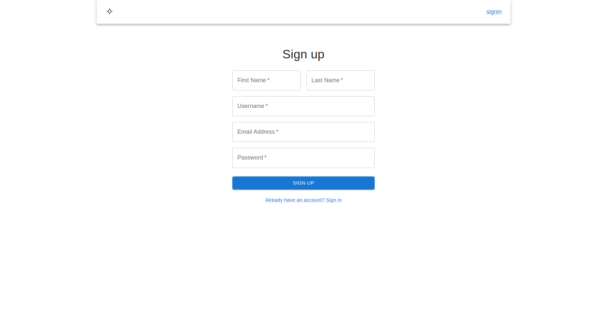

# Starwars Gallery

Web Gallery implementing star wars's rest api for displaying characters, rating characters, and filtering characters by movies
## Features
<ul>
  <li>Modern Design with Material UI</li>

  <li>Buffering loaders</li>

  <li>Star Rating for each character</li>

  <li>Floating event notifications</li>

  <li>API pagination for seamless browsing</li>

  <li>Filter characters by Movie with Autocomplete</li>

  <li>Delete single rating by just removing stars</li>

  <li>Delete all ratings on the ratings tab</li>

  <li>Authentication with JWT</li>

</ul>

## ⚙ Automatic Setup with Setup Script
### Requirements: Git, Docker, Npm, Npx  🔑🔑🔑

⚠️  Please make sure you have all the dependencies setup for the script to run correctly
```bash
    git version
    docker -v
    npm -v
    npx -v
 ```
Clone the repository locally
```bash
    git clone git@github.com:HatemTemimi/starwars-ratings.git
 ```

Setup the project with setup script
```bash
    cd starwars
    chmod a=r setup.sh
    ./setup.sh
```
## ⚙ Manual Setup 
### Requirements: Git, Docker, NPM 🔑

Clone the repository locally
```bash
    git clone git@github.com:HatemTemimi/starwars-ratings.git
 ```

Pull & Run Postgres Database container
⚠️  Run the container with POSTGRES_PASSWORD=password

```bash
    docker pull postgres:16rc1-alpine3.18
    docker run -d --network host -e POSTGRES_PASSWORD=password  postgres:16rc1-alpine3.18    
```

Verify that the container is running
```bash
    docker ps 
```
Install backend dependencies
```bash
    cd starwars/server
    npm i
```

Run the Database migration script
```bash
  npx prisma migrate dev
```

Run backend server
```bash
  nest start
```
Install frontend dependencies and run server

```bash
  npm i
  npm start
```

## Snapshots
### Characters Home
:

### User Ratings
:


### Signin
:

### Signup
:
